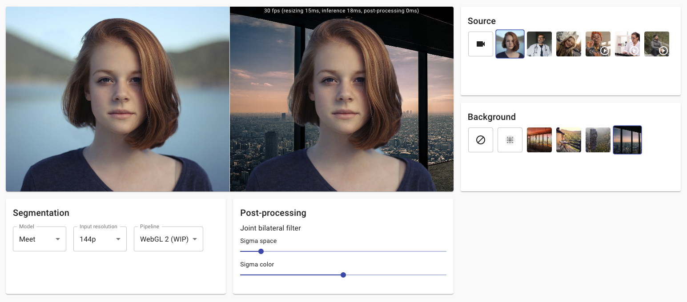

# Virtual Background

> Demo on adding virtual background to a live video stream in the browser.

:point_right: [Try it live here!](https://volcomix.github.io/virtual-background)

## Implementation details

In this demo you can switch between 2 different ML pre-trained segmentation models: [BodyPix](https://github.com/tensorflow/tfjs-models/blob/master/body-pix) and [MediaPipe Meet Segmentation](https://mediapipe.page.link/meet-mc).

### BodyPix

The drawing utils provided in BodyPix are not optimized for the simple background image use case of this demo. That's why I haven't used [toMask](https://github.com/tensorflow/tfjs-models/tree/master/body-pix#bodypixtomask) nor [drawMask](https://github.com/tensorflow/tfjs-models/tree/master/body-pix#bodypixdrawmask) methods from the API to get a higher framerate.

The [drawBokehEffect](https://github.com/tensorflow/tfjs-models/tree/master/body-pix#bodypixdrawbokeheffect) method from BodyPix API is not used. Instead, [CanvasRenderingContext2D.filter](https://developer.mozilla.org/en-US/docs/Web/API/CanvasRenderingContext2D/filter) property is configured with [blur](<https://developer.mozilla.org/en-US/docs/Web/CSS/filter#blur()>) and [CanvasRenderingContext2D.globalCompositeOperation](https://developer.mozilla.org/en-US/docs/Web/API/CanvasRenderingContext2D/globalCompositeOperation) is setup to blend the different layers according to the segmentation mask.

The result provides an interesting framerate on laptop (~20 FPS on MacBook Pro 2017 in Chrome) but is not really usable on mobile (~8 FPS on Pixel 3 in Chrome). On both devices, the segmentation lacks precision compared to Meet segmentation model.

**Note: BodyPix relies on the default TensorFlow.js backend for your device (i.e. `webgl` usually). The [WASM backend](https://github.com/tensorflow/tfjs/tree/master/tfjs-backend-wasm) seems to be slower for this model, at least on MacBook Pro.**

### MediaPipe Meet Segmentation

Meet segmentation model is only available as a [TensorFlow Lite](https://www.tensorflow.org/lite) model file. Few approaches are discussed in [this issue](https://github.com/tensorflow/tfjs/issues/4177) to convert and use it with TensorFlow.js but I decided to try implementing something closer to Google original approach described in [this post](https://ai.googleblog.com/2020/10/background-features-in-google-meet.html). Hence the demo relies on a small WebAssembly tool built on top of [TFLite](https://blog.tensorflow.org/2020/07/accelerating-tensorflow-lite-xnnpack-integration.html) along with [XNNPACK](https://github.com/google/XNNPACK) delegate.

**Note: [Meet segmentation model card](https://mediapipe.page.link/meet-mc) was initially released under [Apache 2.0](http://www.apache.org/licenses/LICENSE-2.0) license (read more [here](ttps://github.com/tensorflow/tfjs/issues/4177) and [here](https://github.com/google/mediapipe/issues/1460)) but seems to be switched to [Google Terms of Service](https://policies.google.com/terms?hl=en-US) since Jan 21, 2021. Not sure what it means for this demo.**

#### Building TFLite to WebAssembly

You can find the source of the TFLite inference tool in the [tflite directory](./tflite) of this repository. Instructions to build TFLite using Docker are described in a dedicated section: [Building TensorFlow Lite tool](#building-tensorflow-lite-tool).

- The Bazel WORKSPACE configuration is inspired from [MediaPipe repository](https://github.com/google/mediapipe/blob/master/WORKSPACE).
- Emscripten toolchain for Bazel was setup following [Emsdk repository instructions](https://github.com/emscripten-core/emsdk/tree/master/bazel) and changed to match [XNNPACK build config](https://github.com/google/XNNPACK/blob/ec0bf144ad55cde0698083f12e0a20d4525689a6/BUILD.bazel#L7340).
- TensorFlow source [is patched](tflite/Dockerfile) to match Emscripten toolchain and WASM CPU.
- C++ functions are [called directly from JavaScript](https://emscripten.org/docs/porting/connecting_cpp_and_javascript/Interacting-with-code.html#call-compiled-c-c-code-directly-from-javascript) to achieve the best performance.
- [Memory is accessed directly](https://emscripten.org/docs/porting/emscripten-runtime-environment.html#emscripten-memory-representation) from JavaScript through pointer offsets to exchange image data with WASM.

#### Canvas 2D + CPU

This rendering pipeline is pretty much the same as for BodyPix. It relies on Canvas compositing properties to blend rendering layers according to the segmentation mask.

Interactions with TFLite inference tool are executed on CPU to convert from UInt8 to Float32 for the model input and to apply softmax on the model output.

The framerate is higher and the quality looks better than BodyPix even with the 160x96 model:

| Model   | MacBook Pro 2017 (Chrome) | Pixel 3 (Chrome) |
| ------- | ------------------------- | ---------------- |
| 256x144 | ~36 FPS                   | ~14 FPS          |
| 160x96  | ~60 FPS                   | ~29 FPS          |

#### WebGL 2 (work in progress)

The WebGL 2 rendering pipeline relies entirely on `webgl2` canvas context and GLSL shaders for:

- Resizing inputs to fit the segmentation model (there are still CPU operations to copy from RGBA UInt8Array to RGB Float32Array in TFLite WASM memory - **to be improved**).
- [Softmax](https://en.wikipedia.org/wiki/Softmax_function) on segmentation model output to get the probability of each pixel to be a person.
- Joint bilateral filter to smooth the segmentation mask and to preserve edges from the original input frame (implementation based on [MediaPipe repository](https://github.com/google/mediapipe/blob/master/mediapipe/calculators/image/bilateral_filter_calculator.cc)).
- Blending background image with [light wrapping](https://www.imaging-resource.com/news/2016/02/11/create-natural-looking-composite-images-using-light-wrapping-technique) (**implementation still in progress**).
- [**Not started yet**] Original input frame background blur.

## Possible improvements

- Build TFLite and XNNPACK with SIMD and multithreading support. Few configuration examples are in [TensorFlow.js WASM backend](https://github.com/tensorflow/tfjs/blob/master/tfjs-backend-wasm/src/cc/BUILD).
- Detect WASM features to load automatically the right TFLite WASM runtime. Inspirations could be taken from [TensorFlow.js WASM backend](https://github.com/tensorflow/tfjs/blob/master/tfjs-backend-wasm/src/flags_wasm.ts) which is based on [GoogleChromeLabs/wasm-feature-detect](https://github.com/GoogleChromeLabs/wasm-feature-detect).

## Related work

You can learn more about a pre-trained TensorFlow.js model in the [BodyPix repository](https://github.com/tensorflow/tfjs-models/blob/master/body-pix).

Here is a technical overview of [background features in Google Meet](https://ai.googleblog.com/2020/10/background-features-in-google-meet.html) which relies on:

- [MediaPipe](https://mediapipe.dev/)
- [WebAssembly](https://webassembly.org/)
- [WebAssembly SIMD](https://github.com/WebAssembly/simd)
- [WebGL](https://developer.mozilla.org/en-US/docs/Web/API/WebGL_API)
- [XNNPACK](https://github.com/google/XNNPACK)
- [TFLite](https://blog.tensorflow.org/2020/07/accelerating-tensorflow-lite-xnnpack-integration.html)
- [Custom segmentation ML models from Google](https://mediapipe.page.link/meet-mc)
- Custom rendering effects through OpenGL shaders from Google

## Running locally

In the project directory, you can run:

### `yarn start`

Runs the app in the development mode.\
Open [http://localhost:3000](http://localhost:3000) to view it in the browser.

The page will reload if you make edits.\
You will also see any lint errors in the console.

### `yarn test`

Launches the test runner in the interactive watch mode.\
See the section about [running tests](https://facebook.github.io/create-react-app/docs/running-tests) for more information.

### `yarn build`

Builds the app for production to the `build` folder.\
It correctly bundles React in production mode and optimizes the build for the best performance.

The build is minified and the filenames include the hashes.\
Your app is ready to be deployed!

See the section about [deployment](https://facebook.github.io/create-react-app/docs/deployment) for more information.

## Building TensorFlow Lite tool

A Docker development environment must be initialized before building TensorFlow Lite inference tool.

### `yarn init:tflite`

Builds a Docker development image, starts the container and initializes dependencies required for building TFLite tool.

### `yarn start:tflite:container`

Starts the container, then updates TensorFlow and MediaPipe repositories inside the container.

### `yarn build:tflite`

Builds WASM functions that can infer Meet segmentation models.
